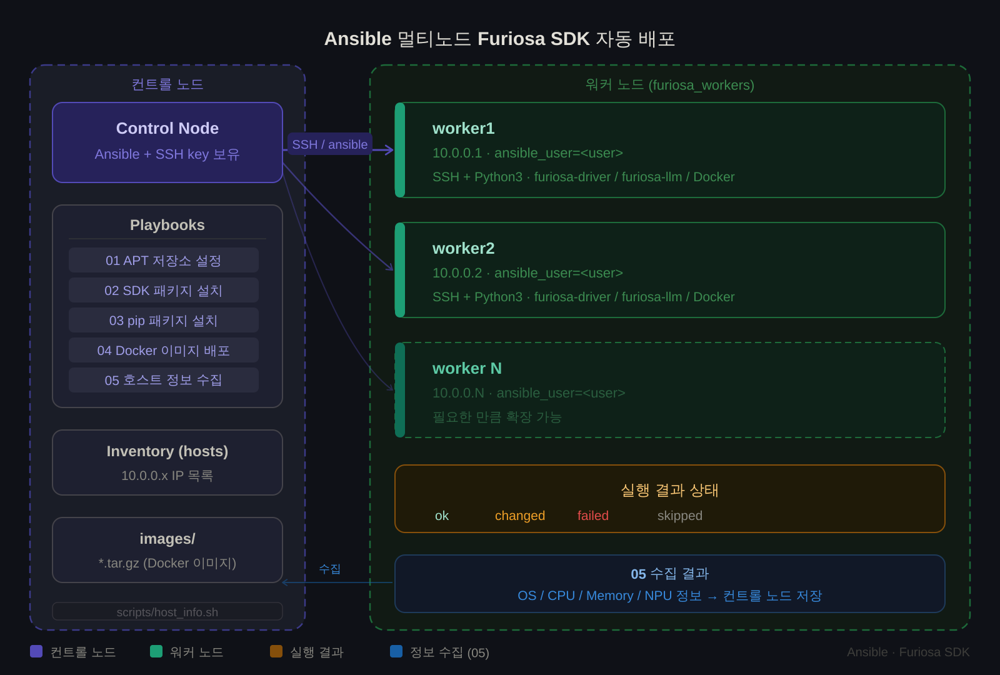

# server-setup-ansible

Ansible 기반 멀티노드 Furiosa SDK 자동 배포 자동화 플레이북 모음입니다.
컨트롤 노드 1대에서 다수의 워커 노드에 SSH로 접속하여 SDK 설치와 firmware 업데이트를 자동화합니다.

워커 노드 OS는 Ubuntu 24.04 (`ubuntu-24.04.4-live-server-amd64.iso`)를 기준으로 합니다.
플레이북과 패키지 버전이 모두 24.04(noble) 기준으로 작성되어 있어 다른 버전에서는
동작하지 않습니다.

---

## 구성 요소

| 구성 요소 | 역할 |
|---|---|
| 컨트롤 노드 | Ansible 설치됨. Playbook 실행 주체. SSH 키 보유 |
| 워커 노드 | Ansible 설치 불필요. SSH + Python3만 있으면 됨 |
| 통신 방식 | 컨트롤 노드 → SSH → 워커 노드 |



---

## 디렉토리 구조

```
.
├── playbooks/
│   ├── 01_apt_setup.yml             # Furiosa APT 저장소 설정
│   ├── 02_sdk_apt.yml               # Furiosa SDK APT 패키지 설치 + firmware 업데이트
│   └── 03_pip_install.yml           # furiosa-llm PIP 패키지 설치
└── scripts/
    └── host_info.sh                 # 워커 노드 정보 수집 스크립트
```

---

## 사전 준비

### 1. 컨트롤 노드에 Ansible 설치

#### Ubuntu
```bash
sudo apt update
sudo apt install -y python3 python3-pip python3-dev
sudo pip3 install ansible
ansible --version
```

#### macOS
```bash
brew install ansible
ansible --version
```

### 2. SSH 키 생성 및 워커 노드 배포

```bash
ssh-keygen -t rsa -b 4096
ssh-copy-id <워커노드_USER_ID_1>@<워커노드_IP_1>
ssh-copy-id <워커노드_USER_ID_2>@<워커노드_IP_2>
ssh-copy-id <워커노드_USER_ID_3>@<워커노드_IP_3>
```

### 3. Ansible 인벤토리 설정

`/etc/ansible/hosts` 파일을 생성하고 `/etc/ansible/hosts` 에 워커 노드 목록을 등록합니다.

```ini
[furiosa_workers]
worker1 ansible_host=<워커노드_IP_1> ansible_user=<워커노드_USER_ID_1>
worker2 ansible_host=<워커노드_IP_2> ansible_user=<워커노드_USER_ID_2>
worker3 ansible_host=<워커노드_IP_3> ansible_user=<워커노드_USER_ID_3>


# Examples
[furiosa_workers]
worker1 ansible_host=192.168.1.101 ansible_user=furiosa
worker2 ansible_host=192.168.1.102 ansible_user=furiosa
worker3 ansible_host=192.168.1.103 ansible_user=furiosa
```

연결 테스트:

```bash
ansible furiosa_workers -m ping
```

---

## 실행 순서

```bash
# Step 1: APT 저장소 설정
ansible-playbook playbooks/01_apt_setup.yml --ask-become-pass

# Step 2: SDK APT 패키지 설치 + firmware 업데이트 (수 분 소요)
#          완료 후 워커 노드가 자동으로 종료됩니다
ansible-playbook playbooks/02_sdk_apt.yml --ask-become-pass
```

Step 2 와 Step 3 사이에는 콜드 부팅이 필요합니다. Step 2 가 워커 노드를 종료시키므로,
전원을 다시 인가하기 전에 Step 3 을 실행하면 `UNREACHABLE` 로 실패합니다. `poweroff`
상태에서는 SSH 로 켤 수 없으므로 BMC 또는 물리 전원으로 켭니다.

부팅 후 `furiosa-smi info` 로 모든 NPU 의 Firmware 버전이 올라갔는지 확인한 뒤 Step 3 으로
넘어갑니다.

```bash
# Step 3: furiosa-llm PIP 패키지 설치 (콜드 부팅 완료 후 실행)
ansible-playbook playbooks/03_pip_install.yml --ask-become-pass
```

### 특정 노드만 실행

```bash
ansible-playbook playbooks/02_sdk_apt.yml --limit worker1
ansible-playbook playbooks/02_sdk_apt.yml --limit 'worker1,worker2'
```

---

## 설치 확인

### 실행 전 — 현재 상태 기록

업그레이드 전후를 비교할 수 있도록 워커 노드에서 미리 기록해 둡니다.

```bash
furiosa-smi info                    # Firmware 버전
dpkg -l | grep furiosa              # 설치된 패키지 버전
```

플레이북에 지정된 버전이 저장소에 실제로 있는지도 미리 확인할 수 있습니다.
문자열이 다르면 Step 2 가 `Version '...' was not found` 로 실패합니다.

```bash
apt-cache madison furiosa-driver-rngd furiosa-firmware-image-rngd \
                  furiosa-firmware-tools-rngd furiosa-smi
```

### Step 2 후 — firmware 플래시 결과

컨트롤 노드로 수집된 로그에서 **장착된 NPU 개수만큼 `Success`** 가 있는지 확인합니다.

```bash
cat ~/logs/firmware_<워커노드명>_<날짜>.log
```

개수가 부족하면 일부 카드가 실패한 것입니다. 재실행하지 말고 로그를 보존한 뒤 문의하세요.

### 콜드 부팅 후 — firmware 버전

```bash
furiosa-smi info
```

- 모든 NPU 의 **Firmware 버전이 목표 버전**인지 확인합니다.
- Temp. / Power 값이 정상적으로 표시되면 드라이버가 디바이스와 통신하고 있다는 뜻입니다.
- 버전이 그대로면 콜드 부팅이 아니라 재부팅만 된 경우일 수 있습니다.

### 패키지 버전

```bash
dpkg -l | grep furiosa
```

이전에 설치된 패키지는 제거되지 않으므로 목록에 남아 있을 수 있습니다.

### Step 3 후 — furiosa-llm

```bash
~/venv/bin/pip show furiosa-llm
~/venv/bin/python -c "import furiosa_llm; print(furiosa_llm.__version__)"
```

---

## Playbook 상세

### 01_apt_setup.yml — Furiosa APT 저장소 설정
- `curl`, `gnupg` 설치
- Google Cloud APT 키 등록
- Furiosa APT 저장소 등록 및 `apt update`

### 02_sdk_apt.yml — SDK 패키지 설치
- `furiosa-driver-rngd`, `furiosa-smi` 설치
- `furiosa-firmware-tools-rngd`, `furiosa-firmware-image-rngd` 설치
- `furiosa_rngd_updater_all -f <firmware image>` 실행으로 firmware 업데이트 (비동기, 최대 30분)
- firmware 업데이트 로그를 컨트롤 노드 `~/logs/` 로 수집
- 업데이트 완료 후 워커 노드 자동 종료

#### 2026.3 부터 달라진 점

2026.3 이전에는 `furiosa-firmware-image-rngd` 를 설치하면 펌웨어가 자동으로 플래시되었습니다.
2026.3 부터는 설치가 이미지 파일을 배치하는 것으로 끝나므로, `furiosa_rngd_updater_all` 을
직접 실행해야 실제 업데이트가 진행됩니다.

updater 를 실행할 때는 `-f` 로 펌웨어 이미지 경로를 지정합니다. 생략하면 스크립트가 대화형
확인(`Use this default firmware image? [y/n]`)을 요구하는데, Ansible 은 stdin 이 없어
응답하지 못하고 무한 루프에 빠집니다. 공식 문서의 `sudo furiosa_rngd_updater_all` 은 사람이
터미널에서 직접 실행하는 경우를 전제로 한 것입니다.

#### 진행 상황 확인

워커 노드에 별도 터미널로 접속해 로그를 볼 수 있습니다.

```bash
tail -f /var/log/furiosa_firmware_update.log
tail -f /var/log/furiosa_rngd_updater.log   # updater 자체 로그
```

장착된 NPU 개수만큼 `Successfully updated RNGD(<BDF>).` 가 출력되면 정상입니다.
카드가 4장이면 4줄이어야 합니다.

플레이북이 성공으로 끝나도 펌웨어가 갱신되지 않는 경우가 있습니다. `furiosa_rngd_updater_all`
은 updater 바이너리가 없거나(`furiosa-firmware-tools-rngd` 미설치) RNGD 디바이스가 인식되지
않으면 오류 메시지만 남기고 정상 종료(exit 0)합니다. 태스크 결과 대신 로그의 성공 줄 개수와
콜드 부팅 후 `furiosa-smi info` 로 확인합니다.

#### 작업 시 주의

- 업데이트 도중 `Ctrl-C` 등으로 중단하지 않습니다. 이미지가 깨지면 전체 재-flash 가 필요하고
  디바이스가 사용 불가 상태가 될 수 있습니다.
- 장착된 RNGD 를 순차로 업데이트하므로 카드 수에 비례해 시간이 걸립니다. 진행이 멈춘 것처럼
  보여도 기다립니다.
- 실패하면 로그를 그대로 보존한 뒤 FuriosaAI 에 문의합니다. 재실행 전에 문의하는 편이
  안전합니다.
- 펌웨어 적용에는 콜드 부팅이 필요합니다. 재부팅(`reboot`)이 아니라 전원을 완전히 차단한 뒤
  다시 인가해야 합니다. 플레이북 마지막 태스크가 워커 노드를 종료시키는 이유입니다.
- 여러 사람이 공유하는 서버라면 작업 전에 다른 사용자에게 확인합니다. 펌웨어 업데이트 후
  워커 노드가 종료됩니다.

### 03_pip_install.yml — furiosa-llm 설치
Python venv (`~/venv`) 를 생성한 뒤 `uv pip install --torch-backend=auto` 로 설치합니다.

설치 패키지: `furiosa-llm==2026.3.0`

`uv` 의 `--torch-backend=auto` 를 사용합니다. 이 옵션이 환경을 감지해 알맞은
PyTorch 휠을 선택합니다. 생 `pip` 으로 설치하면 PyPI 기본 휠(CUDA 포함)을 받아 사용하지 않는
`nvidia-*` 패키지가 함께 설치됩니다. 실측 기준 venv 크기가 8.3GB 에서 2.1GB 로 줄어듭니다
(`torch 2.10.0` → `2.10.0+cpu`).

플레이북이 root 권한으로 실행되므로 venv 가 root 소유로 생성됩니다. 마지막 태스크에서
소유권을 실행 사용자로 넘겨, 이후 사용자가 직접 패키지를 추가할 수 있게 합니다.

---

## 실행 결과 상태

| 상태 | 의미 |
|---|---|
| `ok` | 이미 적용되어 있어 변경 없음 (멱등성) |
| `changed` | 변경 사항이 적용됨 |
| `failed` | 오류 발생 — 로그 확인 필요 |
| `skipped` | 조건(`when`)에 맞지 않아 건너뜀 |

---

## 트러블슈팅

| 문제 | 해결 방법 |
|---|---|
| SSH 연결 실패 | `ssh-copy-id` 재실행, 워커 노드 방화벽(`ufw`) 확인 |
| UNREACHABLE 오류 | `hosts` 파일의 IP/user 확인, ping 테스트. Step 2 이후라면 워커 노드가 종료된 상태인지 확인 |
| apt 패키지 없음 | `01_apt_setup.yml` 먼저 실행 여부 확인. 저장소가 낡은 상태로 남아 있으면 `/etc/apt/sources.list.d/furiosa.list` 삭제 후 재실행 |
| `Version '...' was not found` | 지정한 버전이 저장소에 없음. `apt-cache madison <패키지>` 로 실제 버전 문자열 확인 (배포판별 리비전 suffix 상이) |
| `furiosa_rngd_updater_all: command not found` | `furiosa-firmware-tools-rngd` 설치 여부 확인 |
| firmware 태스크가 끝나지 않고 로그에 `Type 'y' or 'n'.` 이 반복됨 | `-f` 로 펌웨어 이미지 경로를 지정하지 않은 경우. 프로세스를 종료하고 로그 파일을 삭제한 뒤 `-f` 를 추가해 재실행 |
| `Multiple default firmware images found` | `/usr/lib/firmware/furiosa-rngd/` 에 `rngd_fw*` 파일이 여러 개. `-f` 로 사용할 이미지를 명시 |
| 패키지가 hold 되어 apt 변경이 거부됨 | `apt-mark showhold` 로 확인. 의도적인 hold 인지 확인한 뒤 `sudo apt-mark unhold <패키지>` |
| pip 권한 오류 | venv 경로 및 소유자 확인 |
| firmware Success 미출력 | NPU 하드웨어 연결 상태 및 드라이버 재설치 확인. 로그를 보존한 뒤 문의 |
| 콜드 부팅 후에도 firmware 버전이 그대로 | 재부팅(`reboot`)이 아니라 완전한 전원 차단 후 재인가했는지 확인 |
